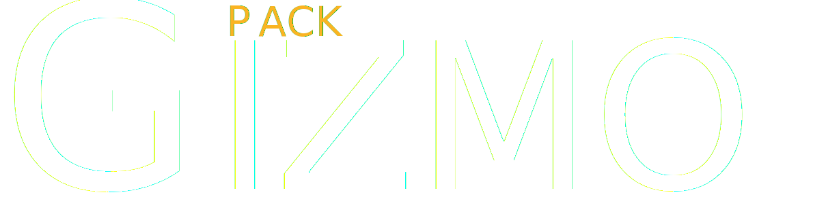

<picture>
    <source media="(prefers-color-scheme: dark)" srcset="[logos]/GizmoPack_Original_White_Orange.svg">
    <source media="(prefers-color-scheme: light)" srcset="[logos]/GizmoPack_Original_Black_Orange.svg">
    
</picture>

# GizmoPack - [[MTA:SA](https://multitheftauto.com/)]

### **Modularna paczka obiektów, rozszerzająca możliwości tworzenia map**

## Klawiszologia | Komendy

| Klawisz | Komenda       | Odpowiada za...                                                                                          |
|---------|---------------|----------------------------------------------------------------------------------------------------------|
| **F2**  | **/editor**   | **Włączenie / Wyłączenie edytora tekstur (Możliwość zmiany klawisza)**                                   |
| **F3**  | -------       | **Włączenie / Wyłączenie statystyk obiektu po najechaniu na niego kursorem (Możliwość zmiany klawisza)** |
| **PPM** | -------       | **Włączenie / Wyłączenie kursora gdy jest włączony edytor tekstur**                                      |
| ------- | **/gpupdate** | **Pobieranie aktualizacji gdy jest ona dostępna (Wymaga uprawnień Administratora w ACL)**                |

## Zalety

* **Brak watermarka na ekranie**
* **Możliwość zablokowania otwierania edytora tekstur**
* **Możliwość dodania własnych tekstur do edytora tekstur**
* **Możliwość teksturowania aż czterech warstw na jednym obiekcie (oczywiście które posiadają taką opcje)**

## Linki

* **[Discord](https://discord.com/invite/QkpgG4UKCP) wsparcia technicznego, informacji o aktualizacjach i nie tylko**
* **[Playlista](https://www.youtube.com/watch?v=2-fFXPNA6yY&list=PL0n61-pLLdETxEQEqz3fyQ18xTReJ7Wra) aktualizacji (Youtube)**

## Autorzy

* **THEGizmo | [THEGizmoOfficial](https://github.com/THEGizmoOfficial) (Modeler, główny założyciel projektu)**
* **XeN | [XeNikk](https://github.com/XeNikk) (Programista, wydawca edytora tekstur, pomoc w projekcie)**